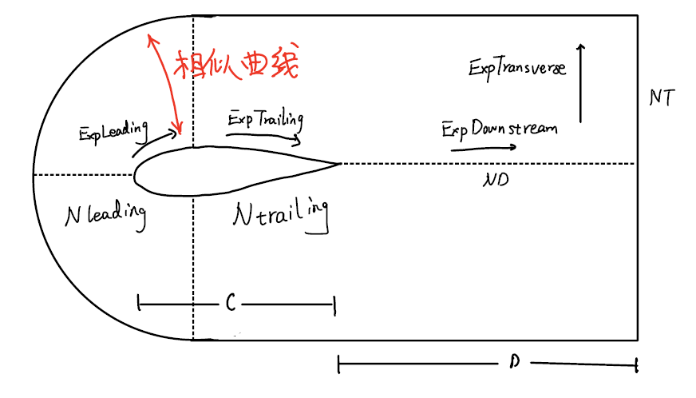
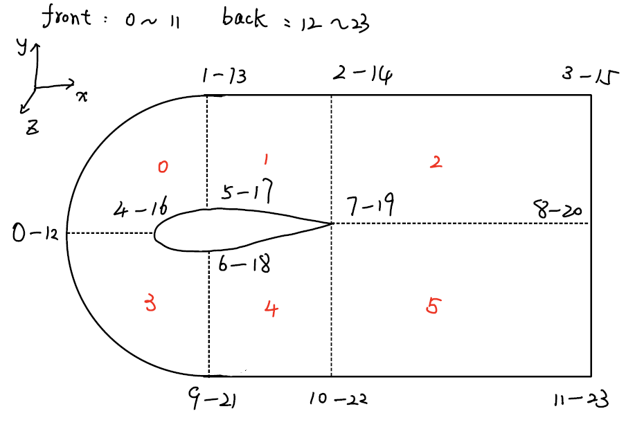

# NACA翼型贴体网格blockMeshDict
---

> 利用python生成NACA翼型贴体网格的blockMeshDict文件

blockMeshDict的文件结构可以参照[[【OpenFOAM】blockMeshDict文件介绍]]

该程序是在[[【OpenFOAM】利用python生成NACA翼型blockMeshDict]]基础上进一步修改，故以下信息一致
- 节点编号
- block编号
- 膨胀系数方向

本程序是对*Pete Bachant*的程序进行的修改：[petebachant/NACAFoil-OpenFOAM](https://github.com/petebachant/NACAFoil-OpenFOAM)

---

## 程序运行方式
提供翼型类型{foil}（**取消了翼型攻角的选项**）
```bash
pyhton blockmeshdict.py {foil}
```

例如NACA0012的情况下：
```bash
pyhton blockmeshdict.py 0012
```


## 控制参数
### Foil geometry
- c：翼型长度
- ~~alpha：翼型攻角~~
- NACA：用于存储翼型类型，比如NACA0012中四个参数

### Mesh dimensions
-  scale： 缩放因子
-  ~~H ：通道的宽度~~
-  W：z方向的==一半宽度==
-  D：下游的宽度
-  scalingX：x方向缩放因子，使得前缘网格边界和翼型前缘相似
-  scalingY：y方向缩放因子，使得前缘网格边界和翼型前缘相似

**取消了通道宽度选项，采用相似曲线的计算方式**

### Mesh resolution parameters
- Ni：生成翼型外形曲线时需要的点的数量，越大越好
- Nleading：翼型前缘的的网格数量
- Ntrailing：翼型下游的网格数量
- ND：下游的网格数量
- NT：横向的网格数量
- NW：z方向上的网格数量，二维情况为1

### Expansion rates
- ExpTransverse：横向膨胀因子
- ExpDownstream：下游膨胀因子
- ExpLeading：翼型前缘的膨胀因子
-  ExpTrailing：翼型下游的膨胀因子

### 示意图



## 网格节点示意图



## 相似曲线算法简要说明
```python
# Edge 0-1 and 12-13
pts9_x = pts1[:,0] * scalingX
pts9_x = pts9_x - (pts9_x[-1] - pts1[:,0][-1])

pts9_y = pts1[:,1] * scalingY
pts9 = np.concatenate([pts9_x, 
					   pts9_y, 
					   W*ones(np.shape(pts9_x))], axis=1)

pts11 = np.concatenate([pts9[:, 0], pts9[:, 1], -pts9[:, 2]], axis=1)


# Edge 0-9 and 12-21
pts10_x = pts3[:,0] * scalingX
pts10_x = pts10_x - (pts10_x[-1] - pts3[:,0][-1])

pts10_y = pts3[:,1] * scalingY
pts10 = np.concatenate([pts10_x, 
						pts10_y, 
						W*ones(np.shape(pts10_x))], axis=1)

pts12 = np.concatenate([pts10[:, 0], pts10[:, 1], -pts10[:, 2]], axis=1)
```

参数说明：
- pts9_x：边0~1的x坐标（x_out）
- pts9_y：边0~1的y坐标（y_out）
- pts1[:,0]：边4~5的x坐标（x_in）
- pts1[:,1]：边4~5的y坐标（y_in）

注意：由于翼型头部起始点位于**原点(0,0)**，且为了边0~1和边1~2可以拼接起来，需要沿着x方向平移一定的距离

$$
x_{out} = x_{in} * scalingX
$$
$$
x_{out} = x_{out} - (x_{out}[end] - x_{in}[end])
$$
$$
y_{out} = y_{in} * scalingY
$$
