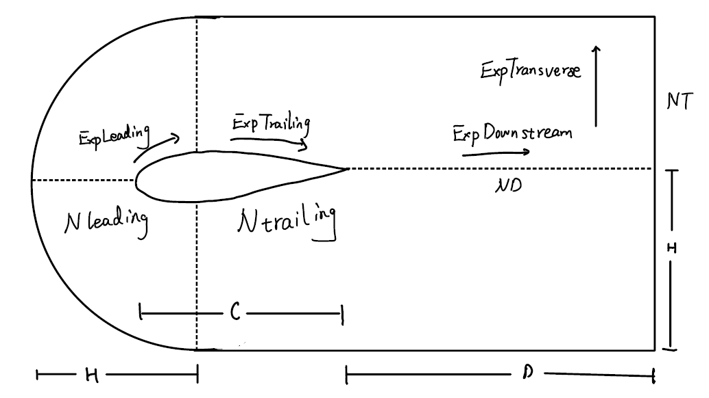
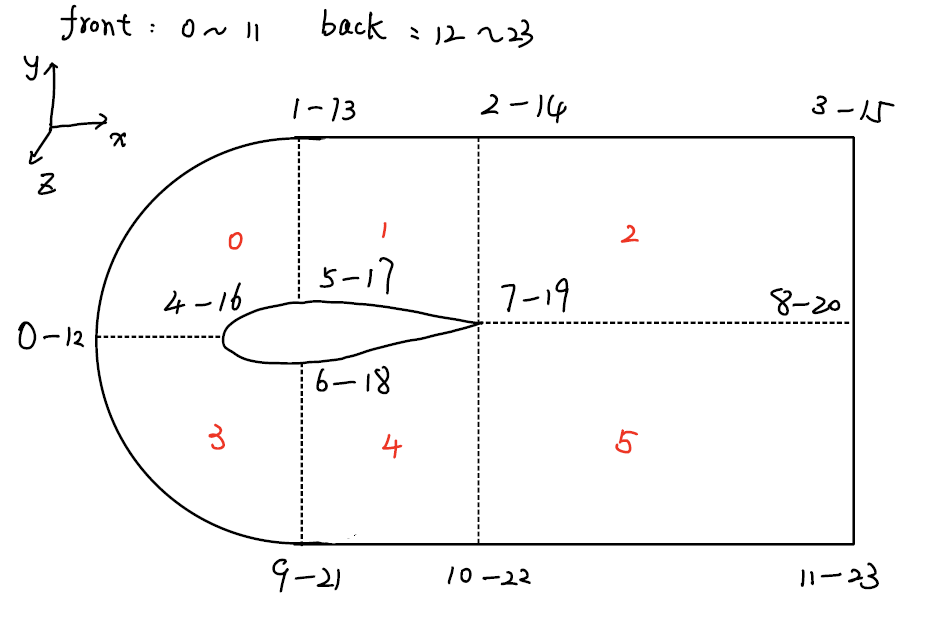

# NACA翼型blockMeshDict
---

> 利用python生成NACA翼型的blockMeshDict文件，相当于参数化控制


blockMeshDict的文件结构可以参照[[【OpenFOAM】blockMeshDict文件介绍]]

本程序是对*Pete Bachant*的程序进行的修改：[petebachant/NACAFoil-OpenFOAM](https://github.com/petebachant/NACAFoil-OpenFOAM)

---

## 程序运行方式
提供翼型类型{foil}，以及翼型攻角{alpha_deg}
```bash
pyhton blockmeshdict.py {foil} {alpha_deg}
```

例如NACA0012在攻角为8的情况下：
```bash
pyhton blockmeshdict.py 0012 8
```


## 控制参数
### Foil geometry
- c：翼型长度
- alpha：翼型攻角
- NACA：用于存储翼型类型，比如NACA0012中四个参数

### Mesh dimensions
-  scale： 缩放因子
-  H ：通道的宽度
-  W：z方向的==一半宽度==
-  D：下游的宽度

### Mesh resolution parameters
- Ni：生成翼型外形曲线时需要的点的数量，越大越好
- Nleading：翼型前缘的的网格数量
- Ntrailing：翼型下游的网格数量
- ND：下游的网格数量
- NT：横向的网格数量
- NW：z方向上的网格数量，二维情况为1

### Expansion rates
- ExpTransverse：横向膨胀因子
- ExpDownstream：下游膨胀因子
- ExpLeading：翼型前缘的膨胀因子
-  ExpTrailing：翼型下游的膨胀因子

### 示意图


### 代码

```python
# Foil geometry
c = 1.0 # Geometric chord length
alpha = np.deg2rad(alpha_deg) # Angle of attack (in radians)
NACA = [int(d) for d in foil] # NACA 4-digit designation

# Mesh dimensions
scale = 1 # Scaling factor
H = 8 # *Half* height of channel
W = 0.5 # *Half* depth of foil (z-direction)
D = 16 # Length of downstream section

# Mesh resolution parameters
Ni = 400 # Number of interpolation points along the foil

# Nx = 200           # Number of mesh cells along the foil
Nleading = 40 # Number of mesh cells along the leading foil
Ntrailing = 20 # Number of mesh cells along the trailing foil

ND = 150 # Number of cells in the downstream direction
NT = 100 # Number of cells the transverse direction
NW = 1 # Number of cells in the z-direction (along the foil axis)

# Expansion rates
ExpTransverse = 100 # Expansion rate in transverse direction
ExpDownstream = 1 # Expansion rate in the downstream direction
ExpLeading = 1 # Expansion rate in the leading foil
ExpTrailing = 1 # Expansion rate in the trailing foil
 
```

## 网格节点示意图


节点分布：
- 编号0~11的节点位于front面上（z大于0）
- 编号12~23的节点位于back面上（z小于0）


**注意问题**
```
blocks 
( 
    hex (16 17 13 12 4 5 1 0)    
    hex (17 19 14 13 5 7 2 1)     
    hex (19 20 15 14 7 8 3 2)    
    hex (4 6 9 0 16 18 21 12)      
    hex (6 7 10 9 18 19 22 21)     
    hex (7 8 11 10 19 20 23 22)   
); 
```

定义block时，一定要注意右手法则，xyz三个方向都要考虑，如下面的hex定义就会出现==负体积==的问题
```
blocks 
( 
    hex (4 5 1 0 16 17 13 12) 
	hex (5 7 2 1 17 19 14 13)     
    hex (7 8 3 2 19 20 15 14)    
    hex (16 18 21 12 4 6 9 0)      
    hex (18 19 22 21 6 7 10 9)     
    hex (19 20 23 22 7 8 11 10)
);
```

